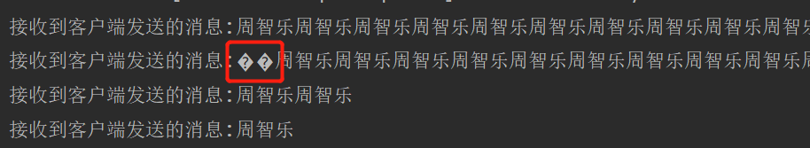

### 复习Nettyy时创建
#### 1.初步实现Netty的发送与回复消息
* 创建ClientSimpleHander、ServerSimpleHandler
* 消息发送时，将消息转换成ByteBuf
* 问题: 如果在for循环内发送消息，会出现粘包、拆包现象。如图：

#### 2.粘包、拆包问题处理
* 自定义一种传输数据的协议：MyProtocal,包含两个属性: 
len:byte数组的长度 
byte[]:存放传输的消息 
* 客户端创建MyProtocalClientHandler,在for循环内传输MyProtocal格式的消息给下一个ChannelHandler。
* 客户端创建MyMsgToByteEncoder,解析从上一个ChannelHandler中获取的MyProtocal格式的消息，将消息发送到服务端。
* 服务端创建MyByteToMsgDecoder,去读取消息。先读取len属性,再去读取len长度的消息。保证消息不会粘包、拆包。
* 客户端将读取到的消息，封装成MyProtocal格式,交给MyProtocalServerHandler做业务处理。
